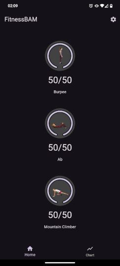
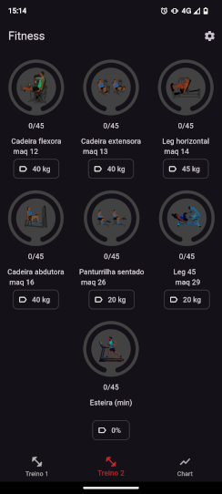
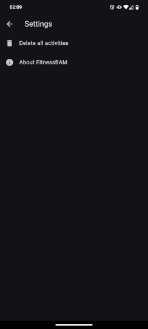

# FitnessBAM

A fitness app with burpee, ab and mountain climber as exercises. Exercise count
automatically resets every day.

# Screens

  

# Images

All images are released under the CC BY-SA 4.0 license.

The **exercise_4countburpee.webp** file was obtained from [Feeel](https://gitlab.com/enjoyingfoss/feeel) app source
code repository. Licensed under the [CC BY-SA 4.0 license](https://creativecommons.org/licenses/by-sa/4.0/).
Derived from a triangulation by kettenfett, which was derived from ["The 6-Minute Sweat Workout: Burpee"](https://www.youtube.com/watch?v=sHLu6-liUL0)
by ExperienceLifeMag on YouTube, published under the [CC BY 3.0 license](https://creativecommons.org/licenses/by/3.0/legalcode).

The **exercise_abcrunch.webp** file was obtained from [Feeel](https://gitlab.com/enjoyingfoss/feeel) app source code
repository. Licensed under the [CC BY-SA 4.0 license](https://creativecommons.org/licenses/by-sa/4.0/).
Derived from bwanderd's [\"26 Abs 1\"](https://www.flickr.com/photos/86598533@N04/8252254965),
published under the [CC BY 2.0 license](https://creativecommons.org/licenses/by/2.0/).

The **exercise_mountainclimber.webp** file was obtained from [Feel](https://gitlab.com/enjoyingfoss/feeel) app
source code repository. Licensed under the [CC BY-SA 4.0 license](https://creativecommons.org/licenses/by-sa/4.0/).
Derived from a triangulation by kettenfett, which was derived from ["Mountain Climber"](https://vimeo.com/149362946)
by Dr. Greg Wells on YouTube, published under the [CC BY 3.0 license](https://creativecommons.org/licenses/by/3.0/legalcode).

# To Do

- [X] Update screen images from README
- [ ] Add fields to quantities of each exercise
- [X] Refactor source code
- [ ] Update main screen after delete all activities, without the need of quit and launch the app
- [ ] Confirmation after press the button "Delete all activities"
