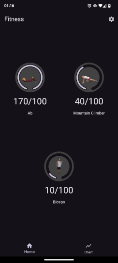
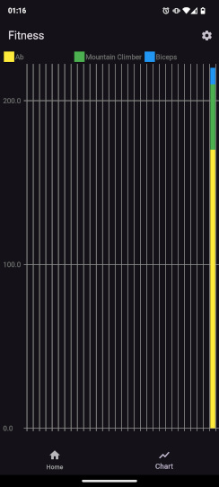

# Fitness

A fitness app with some gym exercises. Exercise count automatically resets
every day.

# Screens

  

# To Do

- [X] Update screen images from README
- [ ] Add fields to quantities of each exercise
- [X] Refactor source code
- [X] Update main screen after delete all activities, without the need of switch tabs
- [X] Confirmation after press the button "Delete all activities"
- [ ] Internationalization (english and portuguese)
